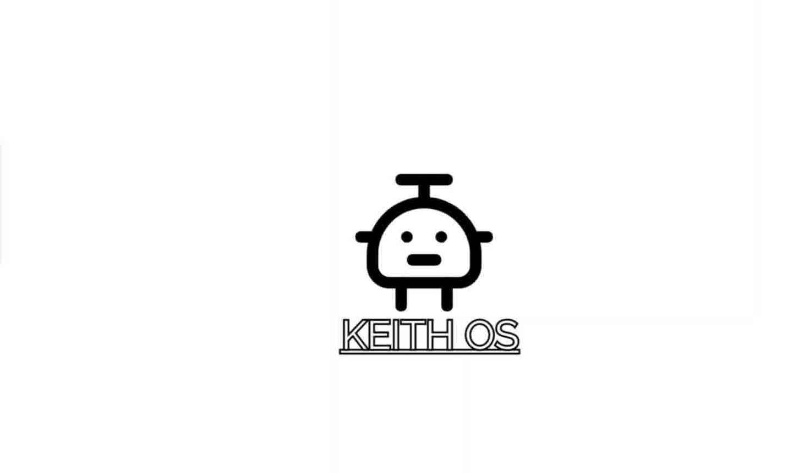
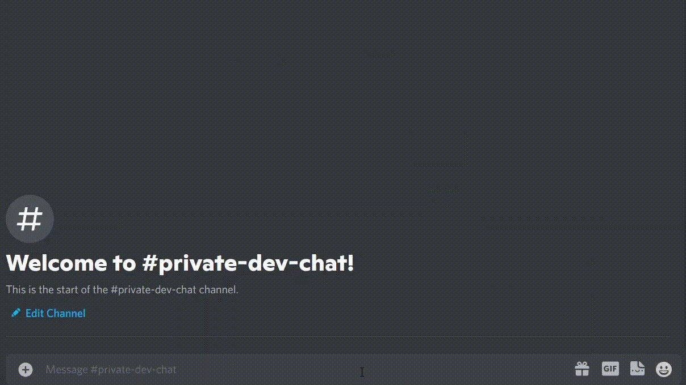

<h1 align="center">
     
    
     
    Keithos Discord Bot Dev Branch
     
  </h1>
  
  <h3 align=center>A fully customizable bot built with <a href=https://github.com/discordjs/discord.js>discord.js</a></h3>
  
  
  

  

  
	
<a href="https://discord.gg/M7nDZxKk24"> Support Discord Server </a>
	
	
<a href="https://discordbotlist.com/bots/keithos">Vote on discordbotlist.com</a>
	
<a href="https://discord.boats/bot/837371090783174696">Vote on discord.boats</a>
	
	

  
  

    <a href="#about">About</a>
    •
    <a href="#features">Features</a>
    •
    <a href="#installation">Installation</a>
    •
    <a href="#license">License</a>
    •
    <a href="#credits">Credits</a>
  

  
  ## About
  
  Keithos is an open source, fully customizable Discord bot that is constantly growing. She comes packaged with a variety of commands and a multitude of settings that can be tailored to your server's specific needs. You can invite it to your Discord server using [this](https://discord.com/api/oauth2/authorize?client_id=837371090783174696&permissions=4294967287&redirect_uri=https%3A%2F%2Fdiscord.events.stdlib.com%2Fdiscord%2Fauth%2F&scope=bot%20applications.commands) link! Also, you can join the official [Keithos Support Server](https://discord.gg/M7nDZxKk24) for all questions, suggestions, and assistance!
  
  If you liked this repository, feel free to leave a star ⭐ to help promote Keithos!
  
  ## Features
  
  **110+** commands and counting across **8** different categories!
  
   * **Administration:** A huge amount of settings to customize with commands like `setprefix`, `setwelcomemessage`, and `setverificationrole`
   * **Moderation:** Commands such as `kick`, `ban`, and `mute` to assist your moderator staff
   * **Fun & Games:** Tons of fun commands like `trivia`, `meme`, `emojify`, and a variety of animal pic commands like `cat`, `dog`, and `fox`
   * **Information:** Commands like `userinfo` and `serverinfo` for general utility
   * **Points:** A unique points system with a rotating winner that has commands like `leaderboard`, `givepoints`, and `crown`
   * **Color:** Change your Discord color with commands like `color`, `createcolor` and `randomcolor`
   * **Miscellaneous:** All other commands like `feedback` and `bugreport`
  
  Keithos also comes packed with a variety of features, such as:
  
   * **Auto role** assignment
   * Server **verification** via reactions
   * **Welcome messages** and **farewell messages**
   * **Logging** for mod commands and various events
   * **Moderator only** channels
   * A **starboard**
   * **Auto kicking** when a warn limit is reached
   * Auto **random colors** when members join
   * Per **command disabling**
   * And much more! There are over **30+** settings to tweak!
  
  
  ## Installation
  
  You can add Keithos to your server with [this](https://discord.com/api/oauth2/authorize?client_id=837371090783174696&permissions=4294967287&redirect_uri=https%3A%2F%2Fdiscord.events.stdlib.com%2Fdiscord%2Fauth%2F&scope=bot%20applications.commands) link!.
  
  
  ### Colors
  
  Upon being invited to a server, Keithos will automatically create **6** predefined colors for your server to enjoy. To add more, use the provided `createcolor` command to quickly and easily create new colors.
  
  To add colors manually, first create a few empty roles at the bottom of your server's role hierarchy. The names of these roles must begin with the character `#`, for example, `#Red` or `#Blue`. Then change the color of that role to your desired hex, and that's it! After they are set up, the members of your server can then change their color by using Keithos color commands!
  
  
  
  ## To-Do
  
  Keithos is in a continuous state of development. New features/updates may come at any time. Some pending ideas are:
  
   * Music
   * Automod
   * Stream alerts
   * Custom tag/reaction system
  
  ## License
  
  Released under the [GNU GPL v3](https://www.gnu.org/licenses/gpl-3.0.en.html) license.
  
  ## Credits
  
  * **MCorange** - *Main work with bot* - [github](https://github.com/MCorange99) - MCorange#0001,
  * **Kaidaras** - *Web design and ideas* - [github](https://github.com/kaidargames) - kaidargames#0525,
  * **Typo** - *Ideas and emotional support* - typo#0922,
  * **Nettles** - Original bot was Calypso, Author [GitHub](https://github.com/sabattle/CalypsoBot).
